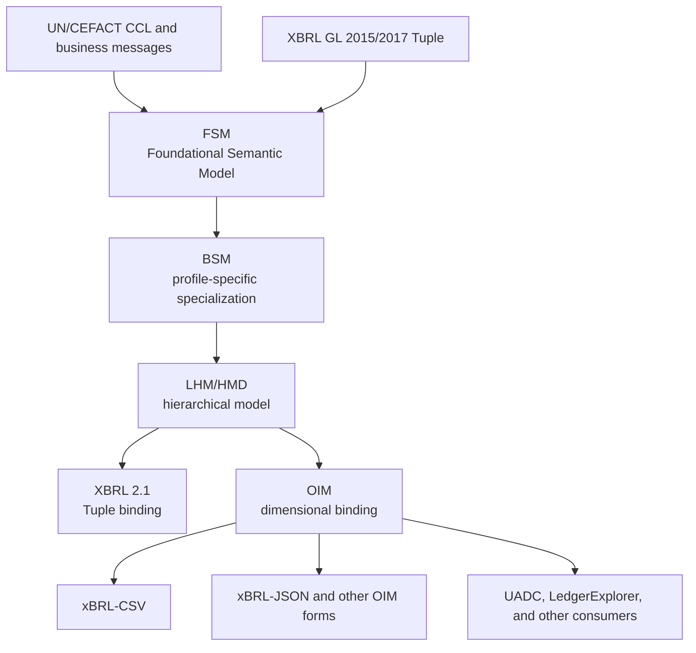

**English** | [日本語](README_ja.md)

# XBRL GL Next

## 1. About this project

This repository is a working environment for investigating and implementing a
next-generation XBRL GL taxonomy for the XBRL Open Information Model (OIM),
including xBRL-CSV. XBRL GL 2015 and the 2017 work product, both based on XBRL
2.1 tuples, are used as semantic and compatibility reference points.

> **Important project status**
>
> XBRL GL Next is an independent Proof of Concept (PoC) intended to support
> international collaborative study. Nothing in this repository is an
> approved specification, standard, implementation recommendation, or
> official position of XBRL Japan, XBRL Europe, XBRL International, or any
> other organization. References to organizations and external standards do
> not imply endorsement, sponsorship, affiliation, or an official joint
> project. Unless explicitly identified as a released artifact, all
> documents, models, taxonomies, programs, and validation results are Working
> Drafts or prototypes.

The present sharing scope is private technical collaboration. This repository
does not currently provide a repository-wide license that can be assumed to
cover every artifact. Absence of a license notice is not permission to copy,
modify, or redistribute a file. External and derived materials remain on hold
until their provenance and rights are confirmed. MIT applies only to
identified project-authored scripts, and CC BY 4.0 applies only to identified
project-authored documentation and artifacts. External originals and
derivatives remain subject to their respective owners' terms and are not
registered, even in the Private repository, while rights are unresolved. See
[`THIRD_PARTY_NOTICES.md`](THIRD_PARTY_NOTICES.md).

The intended scope is broader than general ledgers. The project uses the
UN/CEFACT Core Component Library (CCL) and business-message standards as
reference material for a coherent semantic model covering:

- ledgers, journal entries, and subsidiary ledgers;
- invoices, orders, shipments, receipts, and payments;
- parties, accounts, products, and other master data;
- traceability among source evidence, transactions, journal entries, and reports;
- drill-down, drill-up, and drill-through from annual-report figures to
  statements, account balances, entries, business documents, and source evidence;
- granular operational data for statistics, audit, and analysis.

The OIM/Palette dual-support prototype currently uses the provisional taxonomy
date `2026-12-31`. Remaining `2026-MM-DD` values and `TBD` markers are
placeholders, not release identifiers.

## 2. Target architecture

The semantic model is separated from XML hierarchy and CSV layout. Tuple XBRL
and dimensional OIM taxonomies are intended to be generated from the same
semantic definitions.



Architecture and process diagrams normally use a top-to-bottom (`TB`) layout.
FSM, BSM, and LHM are semantic-model artifacts. HMD is the root-specific
17-column Graph Walk output, not a fourth semantic model. XML Schema, linkbases,
xBRL-CSV metadata, and CSV tables are syntax artifacts. A syntax change should
not change the intended meaning, stable identity, or semantic path.

## 3. Core structure and modeling policy

### 3.1 Core XBRL GL structure

The following structure is retained as a common logical foundation for Tuple
and OIM bindings:

```text
AccountingEntries
├─ DocumentInfo
├─ EntityInfo
└─ EntryHeader
   └─ EntryDetail
```

- `AccountingEntries` is a root that a profile or entry point can specialize
  for a ledger, business document, master-data set, or statistical data set.
- `DocumentInfo` carries identification, creation, period, purpose, and status
  information common to a data set or document.
- `EntityInfo` identifies and describes organizations, businesses, persons,
  and other entities.
- `EntryHeader` contains information and summary values common to one entry.
- `EntryDetail` contains journal lines, document lines, or observations.

The structure is modeled as Classes and Associations before being bound to
tuple containment or to OIM primary items, hypercubes, dimensions, and
identifiers. Compatibility with existing XBRL GL and clarity for new domains
are evaluated separately.

### 3.2 Generalization through type codes

Where semantics permit, a reusable Class and controlled type codes are
preferred to a proliferation of nearly identical Classes. A generic Document,
for example, may use codes for document type, business purpose or role, and
document status. This does not merge Classes whose properties, Associations,
cardinalities, or constraints are materially different. Every code list must
record its steward, version, definitions, extensibility, and external mappings.

### 3.3 Header and detail amounts

The target model supports both detail amounts and independent business facts
at `EntryHeader`, such as line totals, tax-exclusive totals, tax totals,
tax-inclusive totals, allowances or charges, paid amounts, and amounts due.
Reusable Amount structures and amount-type codes are constrained by profile.
Where a header amount is calculable from detail, validation rules must state
currency, sign, rounding, tax treatment, and inclusion rules. OIM dimensions
or identifying aspects preserve the distinction between header and detail scope.

### 3.4 Traceability from reports to evidence

The project aims to represent bidirectional lineage:

- **drill-down** from a reported fact to period, department, account, entry,
  and line-level facts;
- **drill-up** from a detailed fact to balances, statement items, and annual
  report figures;
- **drill-through** from accounting entries to invoices, orders, shipment and
  receipt records, payments, contracts, and source evidence.

Lineage is represented through stable identifiers, semantic paths,
document/entry/line identifiers, source references, entity, period, unit,
dimensions, and calculation or aggregation relationships. Sign, translation,
rounding, consolidation scope, reclassification, and adjustment entries must
remain traceable. A reference to restricted evidence must not disclose the
evidence itself; existence, identity, and access authorization are separate.

## 4. Shared, Aligned, and Distinct

Classification is based on semantic scope, not merely origin or similar names.
CCL ABIEs, BBIEs, and ASBIEs are assessed individually for reuse, definition,
datatype, constraints, and business context.

### 4.1 Shared

Shared defines standard concepts and structures that can be used across
countries, legal systems, industries, and implementations. A broadly used
ABIE such as Party, Part, Document, Invoice, Shipment, or Customs may be
Shared, while not every BBIE or ASBIE defined under the corresponding external
model is Shared. A Shared ABIE contains only properties accepted as broadly
cross-domain.

### 4.2 Aligned

Aligned provides standard definitions that preserve alignment with a regional
or national standard, legislation, regulation, or a publicly available
industry standard. It may add or constrain BBIEs and ASBIEs relative to Shared,
or define an ABIE for which no Shared counterpart exists. A Shared ABIE is not
silently modified; an Aligned specialization has its own identity.

Aligned Profiles are represented as domain FSM tables, and their definitions
form the Aligned Pool. Mappings to CCL and other sources record release,
business context, and a relationship such as `equivalent`, `broader`,
`narrower`, `partial`, or `no match`.

### 4.3 Distinct

Distinct is reserved for definitions specific to an enterprise, enterprise
group, product, bilateral trading relationship, or other closed community. A
definition is not Distinct merely because it implements national law or a
public industry standard. Distinct extensions use an independent namespace
and state their relationship to Shared and Aligned.

These categories are governance classifications covering reuse, inheritance,
namespace ownership, review, versioning, and deprecation—not directory names.

## 5. Current repository structure

| Path | Purpose | Current status |
| --- | --- | --- |
| `TaxonomyFramework/` | Requirements, six Framework documents, Phase 0 records | Inventory and registration scope prepared |
| `source/models/core/` | Ledger-oriented FSM, BSM, and LHM | Study snapshot |
| `source/models/business-transactions/` | Business-document FSM, BSM, and LHM | Study snapshot |
| `source/unece/` | CCL D25A-derived BIE, FSM, and context material | Shared/Aligned candidates; redistribution review required |
| `taxonomy/tuple/` | Tuple modules and palette | Comparative prototype |
| `taxonomy/oim/prototype/` | OIM/Palette dual-support taxonomy | Provisional `2026-12-31` baseline; checked with XMLSpy and Arelle |
| `taxonomy/experiments/` | Party, Document, and code-list experiments | Technical experiments |
| `examples/vendor-invoice/` | Vendor-invoice CSV and xBRL-CSV metadata | End-to-end candidate, not a completed conformance example |
| `tools/semantic/` | FSM/BSM/LHM transformation tools | Multiple candidate implementations; target contracts not yet integrated |
| `tools/taxonomy/` | LHM-to-XBRL/OIM generation | Prototype |
| `contracts/` | Consumer mapping and release-manifest proposals | Draft contracts |
| `integration/` | Candidate consumer inventory | Initial investigation |
| `docs/` | Architecture, work plans, and decisions | Working documentation |
| `tests/` | JSON, XML, CSV, and entry-point checks | Repository checks exist; broader automation remains |

Source selection, exclusions, and known quality issues are recorded in
[`docs/source-inventory.md`](docs/source-inventory.md).

## 6. Taxonomy Framework documents

The review order is:

1. `XBRL_GL_Next_Requirements_Specification_revised.docx`
2. `XBRL_GL_Next_Taxonomy_Framework_Part_1_General_rules_revised.docx`
3. `XBRL_GL_Next_Taxonomy_Framework_Part_2_XBRL_2_1_palette_taxonomy_revised.docx`
4. `XBRL_GL_Next_Taxonomy_Framework_Part_3_xBRL_CSV_palette_taxonomy_revised.docx`
5. `XBRL_GL_Next_Taxonomy_Framework_Part_4_Aligned_pool_for_extension_revised.docx`
6. `XBRL_GL_Next_Taxonomy_Framework_How_to_extend_the_taxonomy_revised.docx`

Together they cover requirements; FSM→BSM→LHM processing; Graph Walk;
Shared/Aligned/Distinct governance; Tuple palette/profile assembly;
OIM hypercubes, dimensions, and definition linkbases; the Aligned Pool; and
extension examples. These files remain review artifacts until their rights,
status, and release scope are explicitly confirmed.

## 7. Semantic models

### FSM

The Foundational Semantic Model records reusable Classes, Attributes,
Associations, definitions, datatypes, and cardinalities. It also holds
candidates for Shared, Aligned, and Distinct definitions.

Class identity is `(module, class_term)`. A referenced Class is identified by
`(associated_module, associated_class)`. Association property identity is
`(association_role, associated_module, associated_class)`; `property_term` is
not part of Association identity. Logical modules are
not QName prefixes or namespace URIs; syntax bindings assign those later.

A child Class specializes a superclass by deleting, changing, or adding
properties. `property_type`, Association kind, cardinality, IDs, and sequence
are not part of Association property identity. If a superclass and child each
contain one matching Association, the child may change its property type and
cardinality. In an Aligned Extension definition, `0` or `0..0` removes an
inherited property and is not emitted as a valid property.

Duplicate Association identities within one Class are input errors. During
the PoC, unaffected Classes and unambiguous properties may continue to a
partial BSM, but an ambiguous property is never selected by ID, sequence, or
input order. Roles are not inferred, rewritten, numbered, or silently merged.
The partial BSM and its diagnostic report are one PoC result.

After specialization, manual adoption of a generated FSM sheet is a distinct
step. Domain-wide removals belong in the Aligned Extension; adopters do not
create additional deletions by setting selected properties to zero. They may
narrow an unbounded upper cardinality to one where allowed, select optional
properties, and must retain mandatory properties of an adopted ABIE. Original
FSM, selected profiles, adopted FSM, and differences must be recorded.

| Stage | Original cardinality | Requested result | Permitted |
| --- | --- | --- | --- |
| Aligned Extension specialization | Inherited property not used in the domain | Common deletion instruction `0` | Yes |
| FSM-sheet adoption | `0..1` | `0..0` | No |
| FSM-sheet adoption | `1..1` | `1..0` or omission | No |
| FSM-sheet adoption | `0..*` | `0..1` | Yes |
| FSM-sheet adoption | `1..*` | `1..1` | Yes |

### Generating and adopting an FSM from Aligned Profiles

An implementation declares the applicable Aligned Profiles, runs the recorded
Specialization and Graph Walk implementations, reviews the generated FSM
sheet, selects required ABIEs/ASBIEs/BBIEs, applies permitted cardinality
restrictions, and records the adopted FSM for downstream taxonomy generation.
Script names, versions, inputs, and manual decisions must be reproducible.

### BSM

The Business Semantic Model is the profile- and business-context-specific
specialization of the FSM. It contains only effective properties after
inherited deletions, changes, and additions.

### LHM/HMD

Graph Walk over the declared root Class set produces the combined Logical
Hierarchical Model. Graph Walk from one explicitly supplied root Class QName
produces the root-specific Hierarchical Message Definition directly from the
BSM. Both LHM and HMD use the same 17-column output header. The current
contracts are FSM 15 columns, BSM 16 columns, and LHM/HMD 17 columns.
`property_term` and `association_role` are separate FSM/BSM columns, and BSM
adds only terminal `id` without an `element` column.

One HMD may select only one module's Class for a given `class_term`; same-named
Classes from different modules must not be mixed in one hierarchy.
`semantic_path` identifies the logical path. Elements are prefix-free
lowerCamelCase NCNames, unique within a module. C, A, and REF rows require an
element. An R row has no element when its upper cardinality is one; it requires
a dimension element when the upper cardinality exceeds one or is unbounded.

`source/models/business-transactions/xBRL-GL2.0_FSM_btx.csv` contains 640 rows
without a module. It is study evidence, not a conforming FSM.
The reviewed `working-drafts/FSM.xlsx` input instead contains an explicit
77-row `FSM_btx` sheet with no blank module values.

## 8. Taxonomy modules

| Module | Intended responsibility |
| --- | --- |
| `cor` | Ledger/document envelope and stable accounting core |
| `bus` | Party, address, contact, measurable, and common business structures |
| `muc` | Multicurrency |
| `taf` | Tax |
| `ehm` | Measurement-related structures |
| `srcd` | Existing Tuple source-document module |
| `btx` | Business transactions and business documents |
| `sta` | Statistical observations, measures, and classifications |
| `lnk` | Bidirectional links among transactions, ledgers, evidence, and reports |
| `gen` | Common datatypes and representation terms |
| `plt` | Palette/profile entry points and module assembly |
| `usk`, `jpn`, `ext` | Existing, regional, or purpose-specific extensions |

`sta` is planned but not implemented in the current taxonomy prototype. OIM
bindings express containment through primary items, hypercubes, dimensions,
domains, parent-child relationships, and closed/open settings rather than CSV
row order alone.

## 9. Replacing LHM in other projects

XBRL GL Next is the prospective provider of semantic models and OIM taxonomy
packages. `UADC_PoC` is the initial EN 16931 invoice pilot, and
`LedgerExplorer` is the ledger/subledger pilot. Consumers must use a versioned
release package rather than files inside this working tree.

[`contracts/consumer-mapping-template.csv`](contracts/consumer-mapping-template.csv)
records the migration:

```text
legacy identifier / semantic path
              ↓
          semantic_id
              ↓
new semantic path / OIM concept QName / dimensions
```

Migration uses parallel execution and comparison of semantic facts,
cardinalities, datatypes, units, repeated-row scope, and round trips. See
[`docs/workspace-integration.md`](docs/workspace-integration.md).

## 10. Current progress

Status as of 25 July 2026:

| Work item | Status | Result or limitation |
| --- | --- | --- |
| Work environment and core documents | Complete | Repository structure, architecture, work plan, and source inventory prepared |
| Core architecture | Design direction agreed | FSM→BSM→LHM/HMD→Tuple/OIM, Shared/Aligned/Distinct, vertical diagrams |
| FSM inheritance and extension | Revised design | Aligned deletion and adoption-stage rules documented; program/test alignment remains |
| OIM/Palette baseline | Prototype complete | 46 provisional `2026-12-31` files in `taxonomy/oim/prototype/` |
| OIM/Palette syntax checks | Completed for selected entry points | Arelle and XMLSpy accepted the selected roots; this is not full conformance |
| Review disposition | Complete | Findings recorded in ADR-0003 and ADR-0004 |
| Spreadsheet checks | Complete for reviewed LHM | No missing attribute datatype or duplicate semantic/abbreviation path found in that revision |
| Repository structural check | Implemented | Last recorded result: zero failures and one known warning |
| Phase 0 inventory and registration scope | Complete | Packages, hashes, 99-file comparison, 238-file sharing classification, 478 dependency edges, eight consumer baselines, and registration classes recorded |
| 2015/2017 Tuple baseline | In progress | Official packages identified; machine-readable semantic differences remain |
| Semantic model and generator | In progress | Candidates collected; deterministic target-contract transformation is incomplete |
| xBRL-CSV end to end | Incomplete | Vendor-invoice assets exist, but taxonomy/metadata/instance/lineage consistency is unverified |
| Consumer migration | Not started | Crosswalk, shadow execution, and switch criteria remain |

Earlier review records:

- `docs/decisions/0003-validated-dual-support-taxonomy-baseline.md` —
  **not registered; under reevaluation**
- `docs/decisions/0004-chatgpt-generator-model-review-disposition.md` —
  **not registered; registration on hold**

## 11. Remaining work and plan

The immediate priority is a reproducible FSM→BSM→LHM/HMD baseline, not syntax
binding, profiles, release-manifest implementation, or taxonomy-generator
changes. Programs, fixtures, expected results, tests, execution environment,
commands, exit codes, and SHA-256 results must be treated as one versioned set.

### Phase 0: Inventory and publication scope

Completed on 25 July 2026. Official package metadata, file comparisons,
dependency edges, consumer baselines, and private/public/hold classifications
are recorded. An imported artifact is not publishable until source, version,
checksum, rights status, and purpose are known.

### Phase 1: Reproducible validation environment

Record and fix Python, Arelle, and OIM processor versions; separate source,
models, generated files, samples, and reports; remove hard-coded paths; enable
CLI operation; add minimal synthetic fixtures and CI checks. Completion
requires byte-reproducible output from a clean checkout.

### Phase 2: Baseline the 2015/2017 Tuple taxonomies

Inventory entry points, concepts, types, tuples, linkbases, roles, and
arcroles; graph imports and includes; record version differences; assign
stable source identifiers and semantic dispositions.

### Phase 3: Redesign FSM and module ownership

Define the core Classes, deterministic property specialization, module
ownership, type-code policy, amount scopes, CCL provenance and mapping
relationships, semantic paths, and error-free Class references. Distinguish
heuristic candidates from governance approval.

### Phase 4: Profiles, BSM, and Graph Walk

Define profile declarations and deterministically generate FSM, BSM, and
LHM/HMD with selection/change/deletion reports. Identical approved inputs must
produce identical checksums.

### Phase 5: Dual Tuple/OIM syntax binding

Generate a compatibility Tuple binding and an OIM dimensional binding from the
same semantic model. Define primary items, hypercubes, dimensions, target
roles, metadata, CSV templates, amount scopes, and report-to-evidence lineage.
Tuple and xBRL-CSV samples must represent the same semantic records.

### Phase 6: Domain pilots

1. EN 16931 vendor invoice in `UADC_PoC`;
2. purchase order→invoice→ledger linkage in `LedgerExplorer`;
3. a statistical observation linked to source transactions;
4. annual report→statement→balance→entry→document/evidence lineage.

Each pilot requires source mapping, profile, generated taxonomy, sample,
validation, regression comparison, and bidirectional lineage testing.

### Phase 7: Governance and publication

Establish Shared and Aligned review procedures, namespace/version/deprecation
policies, release manifests and catalogs, and a reproducible Working Draft
package.

## 12. Known issues

1. Modified prototypes still use `xbrl.org` namespaces; public release is on hold.
2. The legacy study CSV retains 640 `FSM_btx` rows with no module; the reviewed
   `working-drafts/FSM.xlsx` input resolves the current PoC scope with an
   explicit 77-row sheet, while any later legacy-row migration still requires
   an approved mapping.
3. Some Shared/Aligned classifications still rely on frequency heuristics.
4. Some transformation candidates lack a complete CLI and use local defaults.
5. Tuple material still contains `2026-MM-DD` placeholders.
6. The `sta` module is not implemented.
7. Selected OIM/Palette entry points were accepted by Arelle and XMLSpy, but
   official DTS, representative Tuple instances, and an OIM/xBRL-CSV sample
   have not completed end-to-end validation.
8. Modified XBRL assets, UN/CEFACT-derived assets, and tools with unresolved
   licenses remain on publication hold.
9. The LHM-to-new-semantic-identity crosswalk is not complete.
10. LHM/HMD and palette/profile terminology is not fully consistent.
11. The formal CVE Class name, identifier, and XBRL GL mapping require review.
12. Governance and initial scope for document type/purpose/status codes remain open.
13. Calculation, rounding, currency, and sign rules for header and detail
    amounts remain open.
14. Historical semantic-model snapshots still require explicit migration to
    the current 15/16/17-column contracts.

## 13. Validation environment and local checks

### 13.1 Confirmed Windows 11 environment

The latest recorded local checks used:

| Tool | Recorded version/configuration | Local configuration | Use |
| --- | --- | --- | --- |
| Arelle CLI | 2.37.77, 64-bit | `$env:ARELLE_CMD` | Automated DTS, instance, OIM, and xBRL-CSV validation |
| Arelle GUI | 2.37.77, 64-bit AMD64 | `$env:ARELLE_GUI` | Interactive review |
| Arelle embedded Python | 3.14.1 | Bundled with Arelle | Arelle runtime only |
| Altova XMLSpy | 2026, 64-bit | `$env:XMLSPY_EXE` | Taxonomy editing and independent inspection |

Do not commit machine-specific executable paths. Example local setup:

```powershell
$env:ARELLE_CMD = "C:\Program Files\Arelle\arelleCmdLine.exe"
$env:ARELLE_GUI = "C:\Program Files\Arelle\arelleGUI.exe"
$env:XMLSPY_EXE = "C:\Program Files\Altova\XMLSpy2026\XMLSpy.exe"
```

The local installation and Arelle version can be checked with:

```powershell
Test-Path $env:ARELLE_CMD
Test-Path $env:ARELLE_GUI
Test-Path $env:XMLSPY_EXE
& $env:ARELLE_CMD --version
```

### 13.2 Repository structural checks

The structural checks require Python 3.10 or later and currently use only the
standard library:

```powershell
python .\tests\check_repository.py
python -m py_compile .\tools\inventory\generate_phase0_manifests.py
```

They check required paths, basic model headers, JSON syntax, XML/XSD
well-formedness, package/source manifests, and consumer baselines. They do not
establish XBRL, OIM, semantic, or external-standard conformance.

The target Specialization implementation reads the 15-column FSM by header,
uses module-qualified identities, reports duplicate or unresolved properties,
supports PoC continuation without silent selection, applies inherited
deletions, and emits a 16-column BSM without `element`.

The target Graph Walk implementation reads that BSM by header and emits a
17-column HMD for one explicit root or a combined 17-column LHM for multiple
roots. It preserves datatype and R/REF semantics, records a non-fatal diagnostic
and continues when a Reference target has no PK, uses no DNM `-o`, and generates
deterministic semantic paths and elements under the rules in Section 7.

### 13.3 XBRL/OIM validation with Arelle

After inventorying an entry point or instance:

```powershell
$project = (Resolve-Path ".").Path
$reportDir = Join-Path $project "TaxonomyFramework\tests\reports"
New-Item -ItemType Directory -Force -Path $reportDir | Out-Null

& $env:ARELLE_CMD `
  --file "<entry point, XBRL instance, or OIM metadata JSON>" `
  --validate `
  --logFile (Join-Path $reportDir "arelle-validation.xml")
```

Actual targets belong in `DEPENDENCIES.md` and the test manifest. XMLSpy
results record product/version, target, time, result, and differences from
Arelle. A manual XMLSpy check alone is not a reproducible acceptance test.

### 13.4 Validation boundaries

Repository checks do not prove XBRL DTS and linkbase conformance, OIM or
xBRL-CSV conformance, semantic equivalence, XML round-trip fidelity, or
conformance to an external standard. Those require Arelle, XMLSpy, an
independent OIM processor, transformation tests, and expected-result
comparison. Acceptance by one processor is not sufficient evidence.

## 14. Continuing review questions

ADR-0004 records the initial review disposition. Continuing reviews cover:

### Architecture

- boundaries among FSM, BSM, LHM/HMD, and syntax binding;
- core-Class responsibilities and cardinalities;
- Class specialization versus type codes;
- header/detail amount scope, currency, rounding, and calculation;
- Tuple containment to OIM dimensional mapping;
- transaction, ledger, evidence, and statistics module boundaries;
- bidirectional lineage and semantic-path stability.

### Shared/Aligned governance

- objective promotion criteria for Shared;
- sufficient UN/CEFACT and external-release provenance;
- evidence for `equivalent`/`broader`/`narrower`/`partial`/`no match`;
- reevaluation, compatibility, and deprecation;
- protection of Shared/Aligned from Distinct override.

### LHM migration

- dependencies on row order, element names, and semantic paths;
- crosswalk representation of split, merge, move, and datatype change;
- shadow execution and rollback;
- separation of consumer syntax binding from provider semantics.

### Validation

- reproducible commands, inputs, versions, logs, and exit status;
- independent Arelle/XMLSpy results and explained differences;
- positive and negative tests;
- deterministic generation;
- comparison of facts, aspects, units, periods, entities, and dimensions;
- reversible drill-down/up and controlled drill-through to evidence.

### Publication

- separation of external originals and modifications;
- traceable source, version, checksum, and license;
- exclusion of logs, caches, real data, credentials, and personal information;
- clear separation of Working Draft and released artifacts.

## 15. Recommended next implementation

First establish the reproducible FSM→BSM→LHM/HMD baseline described in the
current preparation plan. Only after that baseline is registered and
reproduced should work resume on syntax binding, HMD/profile manifests, release
manifests, and taxonomy generation.

The first end-to-end domain candidate remains an EN 16931 vendor invoice
covering document information, parties, amounts/currencies, tax, and source
document references. A following pilot should add annual-report-to-evidence
lineage and verify drill-down, drill-up, and drill-through in both directions.

## 16. Related documents

- `TaxonomyFramework/INVENTORY.md` — **not registered; contains WORK-specific
  inventory and generated-manifest dependencies**
- `TaxonomyFramework/DEPENDENCIES.md` — **not registered; generated dependency
  evidence is under review**
- [`TaxonomyFramework/OPEN_ISSUES.md`](TaxonomyFramework/OPEN_ISSUES.md)
- [`TaxonomyFramework/COPY_PLAN.md`](TaxonomyFramework/COPY_PLAN.md)
- [`docs/architecture.md`](docs/architecture.md)
- [`docs/work-plan.md`](docs/work-plan.md)
- [`docs/workspace-integration.md`](docs/workspace-integration.md)
- [`docs/source-inventory.md`](docs/source-inventory.md)
- [`contracts/README.md`](contracts/README.md)
- [`THIRD_PARTY_NOTICES.md`](THIRD_PARTY_NOTICES.md)
