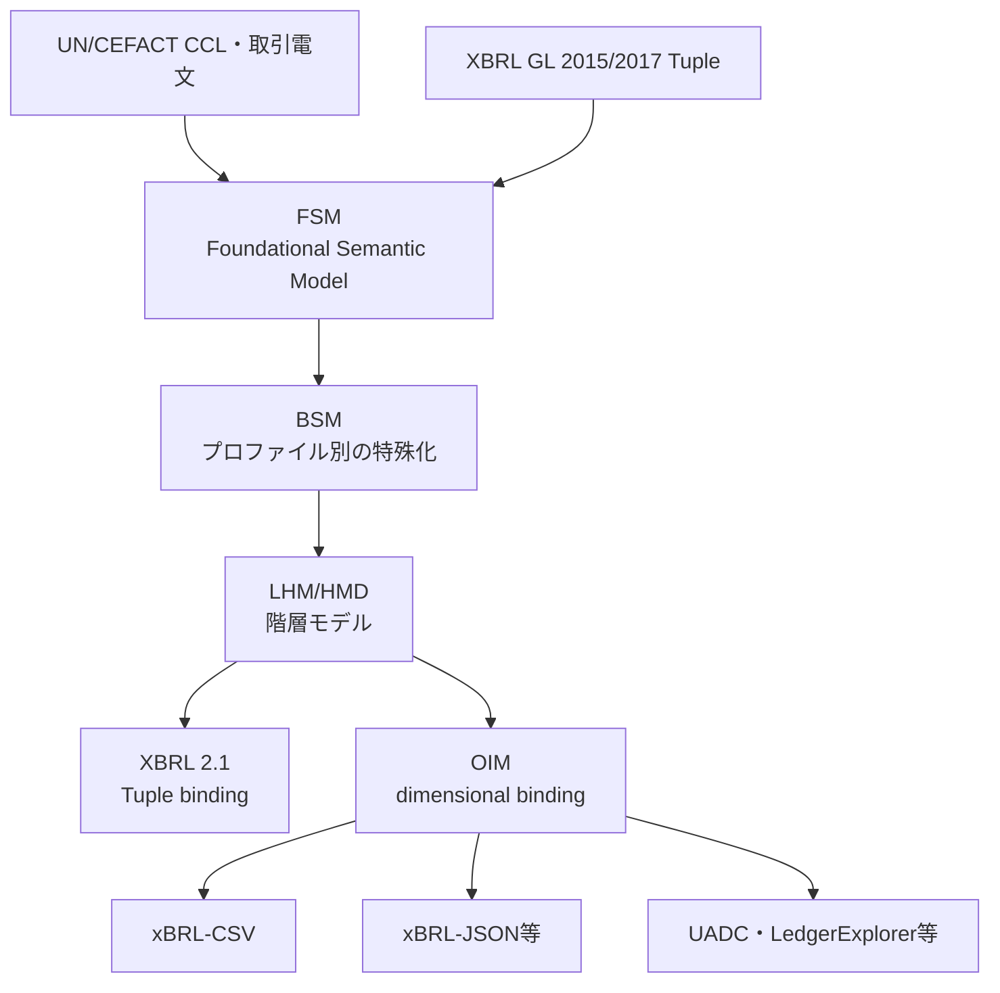

# XBRL GL Next

## 1. このプロジェクトについて

このリポジトリは、XBRL GL 2015及び2017のTuple型タクソノミを出発点として、
XBRL Open Information Model（OIM）及びxBRL-CSVに対応する次世代の
XBRL GLタクソノミを検討・実装するための作業環境です。

対象を会計帳簿だけに限定せず、UN/CEFACT Core Component Library（CCL）と
各分野の取引電文を参照しながら、次のデータを一貫した意味モデルで表現できる
基盤を目指します。

- 会計帳簿、仕訳及び補助元帳
- 請求、注文、出荷、受領及び支払などの取引文書
- 取引先、勘定科目、品目その他のマスタ
- 原始証憑、取引、仕訳及び報告間のトレーサビリティ
- 年次報告書から、その集計根拠となる財務諸表、勘定残高、仕訳明細、
  取引文書及び原始証憑へのドリルダウン、ドリルアップ及びドリルスルー
- 統計、監査及び分析に利用する粒度の細かい業務データ

現在の成果物はすべてWorking Draft又はprototypeです。OIM/Palette
dual-support taxonomyは暫定日`2026-12-31`を使用します。Tuple taxonomy等に残る
`2026-MM-DD`及び文書中の`TBD`は、正式リリース前のプレースホルダーです。

## 2. 目標アーキテクチャ

意味モデルを特定のXML階層やCSV列配置から分離し、一つの意味モデルから
Tuple型XBRLとOIMタクソノミを生成します。



アーキテクチャ図及び今後追加する処理フロー図は、原則として上から下へ進む
`TB`配置とし、文書及び画面で追いやすい縦長の構成を基本とします。

FSM、BSM及びLHM/HMDは意味モデル側の成果物です。XSD、linkbase、
xBRL-CSV metadata及びCSV tableは構文側の成果物です。構文が変わっても
概念の意味、stable ID及びsemantic pathが変わらない設計を基本とします。

## 3. 基本構造とモデル化方針

### 3.1 XBRL GLの基本構造

XBRL GL 2015／2017で使用されてきた次の構造を、Tuple版とOIM版に共通する
基本的な論理構造として維持します。

```text
AccountingEntries
├─ DocumentInfo
├─ EntityInfo
└─ EntryHeader
   └─ EntryDetail
```

- `AccountingEntries`は、対象となる帳簿、取引文書、マスタ、統計データ等の種類に
  応じてprofile又はentry pointで特殊化できるrootとします。
- `DocumentInfo`は、データ集合又は業務文書に共通する識別、作成、対象期間、
  用途及び状態等の情報を保持します。
- `EntityInfo`は、エンティティ（組織、事業者、人物等）の識別及び属性等の
  情報を保持します。
- `EntryHeader`は、個々のentryの親として、entry全体に共通する情報及び
  集計値を保持します。
- `EntryDetail`は`EntryHeader`に属する個々の仕訳明細、文書明細又は観測値を
  保持します。

したがって、`DocumentInfo`、`EntityInfo`及び`EntryHeader`は
`AccountingEntries`の直下に位置し、`EntryDetail`だけが`EntryHeader`の
配下に位置します。

この構造を特定のXML要素配置やCSVの行順へ直接固定せず、FSMのclass及び
associationとして定義したうえで、Tuple containment又はOIMのdimension、
hypercube及びidentifierへbindingします。既存XBRL GLとの互換性維持と、
新しい対象分野における明瞭なモデル化は、別々の評価項目として扱います。

### 3.2 タイプコードによる汎用化

対象物の種類ごとに類似classを増やすのではなく、XBRL GLが各種type codeを
用いて対象物の多様性を表現してきた方法を基本方針とします。

例えば、事業者、組織及び人物については、CVEとして共通の主体要素を定義し、
その役割又は種類をtype codeで区別します。同じ考え方を文書にも適用し、
汎用的なDocument classを定義したうえで、少なくとも次をcodeで表現します。

- 文書の種類（document type）
- 文書の用途又は業務上の役割（document purpose／role）
- 文書の状態（document status）

code化は意味上異なるclassまで無条件に統合するためのものではありません。
属性、関連、多重度又は制約が本質的に異なる場合は、共通classの特殊化又は
Distinct extensionを使用します。各code listについて、管理主体、版、定義、
拡張可否及び外部標準との対応を記録します。

### 3.3 HeaderとDetailの金額

現在のprototypeでは金額を`EntryDetail`配下の個別明細としてしか表現できません。
今後は、明細金額に加えて、`EntryHeader`でentry又は文書全体の各種合計金額を
表現できるモデルへ改訂します。

`EntryHeader`で扱う候補には、明細合計、税抜合計、税額合計、税込合計、
値引・加算合計、支払済額及び支払残額等があります。ただし、特定の文書種類に
固有の合計値をcoreへ固定せず、共通のAmount構造とamount type codeを基本に、
profileで使用可能なcode、必須性及び計算関係を制約します。

Headerの合計値は、Detailから常に算出できるとは限らない独立したbusiness fact
として保持できます。算出可能な場合は、丸め、税計算、通貨、符号及び
包含関係を明示したvalidation ruleによってDetailとの整合性を検証します。
OIM版ではHeaderとDetailのscopeをdimension又は識別aspectで区別し、
同じamount conceptを再利用する場合でも集計レベルを失わないようにします。

### 3.4 報告から根拠データへの追跡

年次報告書の表示値を終点とせず、その値を構成する財務諸表、勘定残高、
仕訳、取引文書及び原始証憑まで、意味と集計関係を保持したまま双方向に
追跡できることを目標とします。

- ドリルダウン（drill-down）：年次報告書の表示項目から、内訳となる期間別、
  部門別、勘定別、仕訳別及び明細別のfactへ段階的に展開する。
- ドリルアップ（drill-up）：明細factから、勘定残高、財務諸表項目及び
  年次報告書の集計値へ戻り、どの報告値へ反映されたかを確認する。
- ドリルスルー（drill-through）：集計階層の上下移動に限定せず、仕訳から
  請求書、注文書、出荷・受領記録、支払情報、契約及び原始証憑等の別の
  データ集合へ横断する。

これらは特定の閲覧画面だけの機能とせず、報告fact、集計fact、明細fact及び
evidenceを結ぶstable identifier、semantic ID、document／entry／line identifier、
source reference、period、entity、unit、dimension及びcalculation／aggregation
relationshipとしてタクソノミと関連メタデータに定義します。

集計関係では、単純合計だけでなく、符号、換算、丸め、期間、連結範囲、
組替え及び調整仕訳を追跡します。個人情報、営業秘密又は非公開証憑へ
ドリルスルーする場合は、参照の存在とアクセス権を分離し、公開用データから
非公開データそのものが漏れない設計とします。

## 4. Shared、Aligned及びDistinct

CCL由来の定義を一律にShared又はAlignedへ分類せず、ABIE、BBIE及びASBIEの
構成と利用文脈に基づいて分類します。ABIEだけを単位として一括判定せず、
その構成要素であるBBIE及びASBIEについても、分野横断的な共通性、意味、
データ型、制約及び利用文脈を個別に評価します。

### 4.1 Shared

国、制度、業界及び実装を越えて分野横断的に共通利用するBBIE及びASBIEと、
それらによって構成されるABIEです。構文に依存しないID、定義、データ型、
semantic path及び変更管理を持たせます。

`Party`、`Part`及び`Document`等のABIEがSharedであっても、そのCCL ABIEに
含まれるすべてのBBIE及びASBIEがSharedになるとは限りません。Shared ABIEは、
Sharedとして承認されたBBIE及びASBIEだけで構成します。

### 4.2 Aligned

対象領域のProfileに必要な定義のうち、Shared ABIEに未定義のBBIE若しくは
ASBIEを追加するもの、SharedのBBIE若しくはASBIEの定義又は制約を変更するもの、
又はSharedに対応するABIEが存在しないものです。

Shared ABIEへの追加又はShared定義の変更が必要な場合は、Shared ABIEを直接変更
せず、Shared ABIEとは異なる一意の名称及び識別子を持つAligned ABIEとして
定義します。Aligned ABIEには、Shared ABIEを基礎として追加又は変更したABIE
だけでなく、Sharedに対応するABIEが存在しない対象領域固有のABIEも含めます。

Alignedは対象領域ごとのFSM表をProfileとして定義します。Aligned Poolは、
対象領域別Profileに含まれるAligned ABIE、BBIE及びASBIEの集合として管理します。
CCL、地域標準、国家標準、法令、規制及び公開業界標準は、いずれもAlignedの
定義元になり得ます。名称の一致だけで自動採用又は分類せず、定義、構成要素、
データ型、制約、業務文脈及び版を比較し、対応関係を次のいずれかとして記録します。

- equivalent：意味及び制約が同等
- broader／narrower：一方が他方を包含
- partial：一部だけが対応
- no match：対応する概念として採用しない

### 4.3 Distinct

企業、企業系列、製品、個別取引関係又は閉じた利用共同体に固有の定義です。
特定の国、法令又は公開業界標準に対応するという理由だけでDistinctにはしません。
独立したnamespaceを使用し、Shared／Alignedとの関係を明示します。

SharedとAlignedは、単なるフォルダ名や類似度判定ではなく、再利用、継承、
namespace、審査、版管理及び廃止手順を含むガバナンス区分として定義します。

## 5. 現在のファイル構成

| パス | 内容 | 状態 |
| --- | --- | --- |
| `TaxonomyFramework/` | 要求仕様、Framework文書6冊及びPhase 0台帳 | 棚卸しと登録範囲を確定済み |
| `source/models/core/` | 会計帳簿中心のFSM、BSM、LHM | 検討用snapshot |
| `source/models/business-transactions/` | 取引文書を含むFSM、BSM、LHM | 検討用snapshot |
| `source/unece/` | UN/CEFACT CCL D25A由来のBIE、FSM及びcontext | Shared／Aligned候補 |
| `taxonomy/tuple/` | Tuple型のモジュール及びpalette | 比較基準prototype |
| `taxonomy/oim/prototype/` | OIM/Palette dual-support taxonomy | 2026-12-31版、XMLSpy／Arelle検証済みbaseline |
| `taxonomy/experiments/` | Party、Document及びcode listの個別実験 | 技術検証用 |
| `examples/vendor-invoice/` | vendor invoiceのCSVとxBRL-CSV metadata | end-to-end例 |
| `tools/semantic/` | BIE→FSM→BSM→LHM変換プログラム | CLI整備が必要 |
| `tools/taxonomy/` | LHMからXBRL/OIM taxonomyを生成するプログラム | 試作 |
| `contracts/` | consumer mapping及びrelease manifest | 移行契約案 |
| `integration/` | WORK配下のconsumer候補台帳 | 初期調査 |
| `docs/` | architecture、作業計画、設計判断 | 初期文書 |
| `tests/` | JSON、XML、CSV及びOIM entry pointの構造検査 | repository検査実装済み、Arelle自動化は残作業 |

コピー元、採用理由、除外対象及び既知の品質問題は
[`docs/source-inventory.md`](docs/source-inventory.md)に記録しています。

## 6. Taxonomy Framework文書

最初に次の順序で確認します。

1. `XBRL_GL_Next_Requirements_Specification_revised.docx`

   `GL-REQ-*`形式で意味モデル、業務範囲、モジュール、OIM及び実装支援要求を
   定義しています。
2. `XBRL_GL_Next_Taxonomy_Framework_Part_1_General_rules_revised.docx`

   FSM→BSM→LHM、Graph Walk、Shared／Aligned／Distinct、module及びprofileの
   全体原則です。
3. `XBRL_GL_Next_Taxonomy_Framework_Part_2_XBRL_2_1_palette_taxonomy_revised.docx`

   Tuple型XBRL 2.1 taxonomyとpalette/profileによる構成方法です。
4. `XBRL_GL_Next_Taxonomy_Framework_Part_3_xBRL_CSV_palette_taxonomy_revised.docx`

   Tuple階層をOIMのhypercube、dimension及びdefinition linkbaseで表現する
   方針です。
5. `XBRL_GL_Next_Taxonomy_Framework_Part_4_Aligned_pool_for_extension_revised.docx`

   Aligned pool、registry、選択、審査及びversion管理を扱います。
6. `XBRL_GL_Next_Taxonomy_Framework_How_to_extend_the_taxonomy_revised.docx`

   Tuple版とOIM版の拡張方法及び例を示します。

## 7. 意味モデル

### FSM

Foundational Semantic Modelは、再利用可能なクラス、属性、関連、定義、
データ型及び多重度を記録する基礎モデルです。Shared、Aligned及びDistinctの
候補もこの層で管理します。

FSMで定義されたスーパークラスは、その子クラスをFSMに定義することによって
特殊化及び拡張します。子クラスはスーパークラスのプロパティを基礎として、
プロパティの削除、変更及び追加を行うことができます。

Classは`(module, class_term)`、Associationの参照先Classは
`(associated_module, associated_class)`で識別します。Association propertyの
同一性は`(property_term, associated_module, associated_class)`で判定します。
`module`及び`associated_module`は論理module識別子であり、QName、prefix及び
namespace URIではありません。これらはXSD等のsyntax bindingで割り当てます。
空roleは空欄のまま有効ですが、同一Class内に同じAssociation property identityを
複数定義できません。
property type、multiplicity、ID又はsequenceが異なっても重複入力エラーとして
報告します。PoC期間中はモデル全体を停止せず、重複のないClass及び一意に処理できる
propertyを継続してBSMを生成します。曖昧なpropertyはID又は入力順で選択せず、
「未反映」又は「要確認」として診断報告へ記録します。roleの推測、補完、連番付与、
書換え又は重複propertyの暗黙統合も行いません。

Association kind及びmultiplicityは同一性判定に含めません。一意に一致する場合、
子Classはproperty type及びmultiplicityを変更できます。Sharedのpropertyの
定義、関連先又は制約を変更する必要がある場合は、Shared ABIEを直接変更せず、
別名のAligned ABIEとして定義します。

対象領域でShared ABIEのpropertyが不要な場合は、個々の採用者が生成後のFSMから
削除するのではなく、当該対象領域のAligned ABIEを定義するExtensionで共通に
削除します。Extensionの特殊化定義では、継承したpropertyのmultiplicityに`0`を
指定して当該propertyを削除し、その結果をBSMとして生成できます。この`0`は
Aligned拡張を定義する段階の削除指示であり、有効なpropertyのmultiplicityでは
ありません。削除理由、対象となるShared property及び適用Profileを記録します。

一方、Profileの選択と`specialization.py`及び`graphwalk.py`の実行によって
生成されたFSM定義成果物の使用段階とは、生成されたFSMシートを手作業で修正し、
後続のtaxonomy生成処理へ渡す採用モデルを作成する段階です。この段階では、
対象領域に共通する削除は既にAligned拡張へ反映されているものとし、採用する
propertyのmultiplicityに`0`を指定して追加の削除はできません。上限`*`は`1`へ
制限できます。

| 変更段階 | 元のmultiplicity | 変更後 | 可否 |
| --- | --- | --- | --- |
| Aligned Extensionの特殊化定義 | 対象領域で不要な継承property | `0`による共通削除指示 | 可 |
| FSMシートによる採用モデル作成 | `0..1` | `0..0` | 不可 |
| FSMシートによる採用モデル作成 | `1..1` | `1..0`又は不採用 | 不可 |
| FSMシートによる採用モデル作成 | `0..*` | `0..1` | 可 |
| FSMシートによる採用モデル作成 | `1..*` | `1..1` | 可 |

生成されたFSMに展開されたASBIE及びBBIEのすべてを採用する必要はありません。
必要なpropertyをFSMシート上で選択できます。ただし、選択されなかった任意property
と、採用したpropertyのmultiplicityを`0`へ変更して削除扱いにすることを区別します。
必須propertyは、当該ABIEを採用する場合には採用しなければなりません。

### Aligned ProfileからのFSM生成及び採用モデルの作成

本規格を採用する実装者は、使用するAligned Profileを宣言します。宣言した
Profileを入力として`specialization.py`及び`graphwalk.py`を実行し、適用可能な
FSM定義成果物を生成します。実際のscript名又は配置が異なる場合は、対応する
実装と版を実行記録に明記します。

実装者は、生成されたFSMシートを手作業で修正し、実際に使用するABIE並びに
必要なASBIE及びBBIEを選択します。許容される範囲でmultiplicityを制限し、
修正後のFSMを採用モデルとして後続のtaxonomy生成処理へ渡します。元のFSM、
選択したProfile、修正後のFSM及び差分を、再現可能な形で記録します。

### BSM

Business Semantic Modelは、profile及びbusiness contextに応じてFSMを特殊化した
モデルです。スーパークラスから継承したpropertyに子クラスの削除、変更及び
追加を適用し、そのprofileで有効なpropertyだけを定義します。

### LHM/HMD

Logical Hierarchical Model又はHierarchical Message Definitionは、選択したrootと
associationをgraph walkで階層展開した構文binding直前のモデルです。
現在の文書とプログラムではLHMとHMDが混在するため、用語統一が必要です。

`source/models/business-transactions/xBRL-GL2.0_FSM_btx.csv`には`module`が空の行が
640件あります。このファイルは正式FSMではなく、検討経過を示す資料として
扱います。

## 8. Taxonomyモジュール

現在の設計では、概ね次の責任分担を想定しています。

| Module | 主な責任 |
| --- | --- |
| `cor` | ledger/document envelopeと安定した会計core |
| `bus` | party、address、contact、measurable等の共通業務構造 |
| `muc` | multicurrency |
| `taf` | tax |
| `ehm` | measurement関連 |
| `srcd` | source document（Tuple側の既存module） |
| `btx` | business transaction及び取引文書 |
| `sta` | statistical observation、measure及びclassification |
| `lnk` | transaction、ledger、evidence及びreport間の双方向linkage |
| `gen` | 共通datatype及びrepresentation term |
| `plt` | profile/palette entry point及びmodule組立 |
| `usk`、`jpn`、`ext` | 既存又は地域・用途別の拡張領域 |

`sta`はFramework上の候補ですが、現在のtaxonomy prototypeにはまだありません。

OIM側では、Tuple containmentをCSVの行順だけで表現せず、primary item、
hypercube、dimension、domain、parent-child relationship及びclosed/open設定で
明示します。

## 9. 他プロジェクトのLHM置換

このリポジトリを意味モデルとOIM taxonomyのproviderとし、WORK配下のプロジェクトを
consumerとして扱います。

- `UADC_PoC`：EN 16931 Invoice LHMを使う最初の取引文書pilot
- `LedgerExplorer`：会計、販売及び購買LHMを使うledger/subledger pilot

consumerはこのworking treeの内部ファイルを直接参照せず、将来作成する版付き
release packageを参照します。移行時は
[`contracts/consumer-mapping-template.csv`](contracts/consumer-mapping-template.csv)
を使用し、次の対応を明示します。

```text
legacy identifier / semantic path
              ↓
          semantic_id
              ↓
new semantic path / OIM concept QName / dimensions
```

一括置換は行いません。既存LHMと新profileを並行実行し、semantic fact、
cardinality、datatype、unit、repeated row scope及びround trip結果を比較してから
切り替えます。詳細は
[`docs/workspace-integration.md`](docs/workspace-integration.md)を参照してください。

## 10. 現在の進行状況

2026年7月25日時点の進行状況は次のとおりです。

| 項目 | 状態 | 現在の成果 |
| --- | --- | --- |
| 作業環境と基本文書 | 完了 | repository構造、README、architecture、work plan及びsource inventoryを整備 |
| 基本アーキテクチャ | 方針確定 | FSM→BSM→LHM/HMD→Tuple/OIM binding、Shared／Aligned／Distinct及び縦長TB図を採用 |
| FSM継承・拡張規則 | 方針改訂 | 対象領域で不要なShared propertyはAligned Extensionで共通削除し、FSMシートによる採用モデル作成時の追加`0`削除は禁止。上限`*`から`1`への制限は可能。programとtestの整合確認が必要 |
| OIM/Palette基準taxonomy | 完了 | `2026-12-31`版46ファイルを`taxonomy/oim/prototype/`へ反映 |
| OIM/Palette構文検証 | 完了 | `plt-oim-2026-12-31.xsd`と`plt-all-2026-12-31.xsd`をArelleで検証し、OIM rootをXMLSpyでも検証 |
| レビュー判断 | 完了 | validなdual-support taxonomyを基準としてChatGPT指摘22件を評価し、ADR-0003及びADR-0004へ記録 |
| Excel定義確認 | 完了 | 改訂版LHMについて属性datatype欠落、semantic path重複及びabbreviation path重複がないことを確認 |
| repository構造検査 | 完了 | `tests/check_repository.py`はfailure 0、既知のwarning 1 |
| Phase 0：棚卸しと登録範囲 | 完了 | 公式package、SHA-256、99件のsource比較（97件同一、WORK側改訂2件）、478 dependency edge、8 consumer baseline及びGitHub登録区分を台帳化 |
| 2015／2017 Tuple基準化 | 進行中 | 公式packageは確定済み。次はconcept、tuple path、type、role及びlinkbaseの機械可読差分を作成 |
| 意味モデルとgenerator | 進行中 | FSM、BSM、LHM及び生成scriptの候補を収集済み。決定的変換とvalid baselineの再生成は未完了 |
| xBRL-CSV end-to-end | 未完了 | vendor invoice例は存在するが、生成taxonomy、metadata、instance及びlineageの一貫検証が必要 |
| consumer移行 | 未着手 | UADC_PoC及びLedgerExplorerのLHM crosswalk、shadow execution及び切替判定が必要 |

現在の適合性基準とレビュー判断は、次のADRを参照してください。

- [`docs/decisions/0003-validated-dual-support-taxonomy-baseline.md`](docs/decisions/0003-validated-dual-support-taxonomy-baseline.md)
- [`docs/decisions/0004-chatgpt-generator-model-review-disposition.md`](docs/decisions/0004-chatgpt-generator-model-review-disposition.md)

## 11. 残作業と作業計画

直近では、validなOIM/Palette taxonomyを手編集された完成例として維持するだけでなく、
FSM、BSM及びLHM/HMDから同じDTS構成を決定的に再生成できる状態にすることを
最優先とします。

残作業の優先順位は次のとおりです。

1. FSM、BSM及びLHM/HMDの正規入力schemaとvalidation ruleを確定し、
   `FSM_btx`のmodule空欄640件を解消又は明示的に除外する。
2. generatorをADR-0003のinclude/import/linkbase構成へ適合させ、valid baseline
   46ファイルを同一入力から再生成する。
3. 公式2015／2017 packageからconcept、tuple path、type、role及びlinkbaseの
   差分を生成し、各conceptのsemantic dispositionを定義する。
4. Arelle検証、XMLSpy release確認、local reference検査及び生成物checksum比較を
   test command又はCIとして自動化する。
5. vendor invoiceを最初のprofileとして、FSM→BSM→LHM/HMD→OIM taxonomy→
   xBRL-CSV metadata／instanceのend-to-end検証を完成する。
6. Summary Amountとfact-level lineageを分離し、年次報告書から財務諸表、
   勘定残高、仕訳、取引文書及び原始証憑への往復経路を`lnk`で検証する。
7. Shared core及びAligned poolの採用・版管理規則を実データへ適用し、
   UADC_PoC及びLedgerExplorer向けcrosswalkを作成する。
8. release manifest、catalog、provenance、license及びconsumer migration contractを
   揃えた最初のWorking Draft packageを作成する。

### Phase 0：棚卸しと公開範囲

- 状態：2026年7月25日完了。
- 公式XBRL GL 2015 Recommendation及び2017 PWDのURL、版、file count及び
  SHA-256を確定しました。
- コピー元とコピー先の選択99ファイルを相対path、size、更新日時及び
  SHA-256で比較しました。コピー時点では99件一致し、現在は97件同一、
  WORK側で意図的に改訂した2件をdifferentとして追跡しています。
- repository 238ファイルをprivate tracking、public candidate、public hold及び
  release対象外に分類しました。
- DTS dependency 478 edge、local missing 5件及びconsumer LHM baseline 8件を
  machine-readable manifestへ登録しました。
- `TaxonomyFramework/INVENTORY.md`、`DEPENDENCIES.md`、`OPEN_ISSUES.md`及び
  `COPY_PLAN.md`を作成しました。
- XBRL International及びUnited Nationsの公開条件を確認し、不明又は制限のある
  成果物をpublic holdにしました。

完了条件：すべてのimport artifactにsource、version、checksum、rights status及び
利用目的がある。不明な権利又は元packageはpermissionと推測せず、公開保留として
処置と責任を`OPEN_ISSUES.md`へ登録する。

### Phase 1：再現可能な検証環境

- Windows 11を基準環境とし、Python、Arelle及びOIM processorのversionを
  記録・固定する。
- Arelle CLIをDTS、XBRLインスタンス及びOIM／xBRL-CSVの標準自動検証手段とする。
- Arelle GUI及びAltova XMLSpyを、DTSの対話的確認、taxonomy編集及び
  独立した相互確認に使用する。
- 原本、意味モデル、生成物、sample及びtest reportを分離する。
- toolの実行ファイルpathはrepositoryへ固定せず、環境変数又はlocal設定で
  上書きできるようにする。
- 変換プログラムのhard-coded pathを除き、CLIを有効にする。
- 最小fixtureとCI検査を追加する。

完了条件：clean checkoutから同じ出力を再生成でき、Arelleによる検証結果を
`TaxonomyFramework\tests\reports`又はrepository内の対応するtest report
directoryへ保存できる。

### Phase 2：2015／2017 Tuple taxonomyの基準化

- entry point、module、concept、type、tuple、linkbase、role及びarcroleを一覧化する。
- schemaLocation、import、include及びlinkbase参照を依存graphにする。
- 2015と2017の差異を機械可読に記録する。
- tuple pathとstable source identifierを作成する。

完了条件：保持する各conceptに意味上の処置が割り当てられている。

### Phase 3：FSM及びmodule再設計

- `AccountingEntries`、`DocumentInfo`、`EntityInfo`、`EntryHeader`及び
  `EntryDetail`を基本classとして定義し、既存Tuple構造との対応を記録する。
- 対象分野ごとの差異は、原則として`AccountingEntries`のprofile又はentry point、
  type code及び制約で表現する。
- スーパークラスのpropertyを、property term（associationの場合はassociation role）、
  associated module及びassociated classによって照合し、子クラスによる削除、変更及び追加を
  決定的に適用する。
- 同一Class内のAssociationを
  `(property_term, associated_module, associated_class)`で事前検証し、同じ組合せが
  複数あればextension処理前に入力エラーとする。
- Association kind及びmultiplicityをproperty identityとは分離して扱う。
- 対象領域で不要なShared propertyは、Aligned Extensionの特殊化定義で
  multiplicity `0`によって共通に削除し、BSMへ反映する。
- FSMシートによる採用モデル作成段階ではmultiplicity `0`による削除を認めず、上限`*`から
  `1`への制限だけを認める。
- 対象領域別Aligned Profileの宣言、`specialization.py`及び`graphwalk.py`による
  FSM生成、FSMシートの手作業による修正、採用ABIE及び使用propertyの選択結果を
  再現可能に記録し、修正後のFSMをtaxonomy生成へ渡す。
- name、definition、datatype、multiplicity及びassociationを正規化する。
- heuristicなShared／Aligned候補と、承認済みgovernance statusを分離する。
- UN/CEFACT CCLをShared候補poolの主要な入力とし、unique ID、release、
  business context及び
  `equivalent`／`broader`／`narrower`／`partial`／`no match`の対応区分を保持する。
- Party及びDocument等の共通対象を汎用classとtype codeの組合せで表現する。
- `EntryHeader`及び`EntryDetail`の双方で利用できるAmount構造を定義し、
  amount type、scope、currency、unit、sign及びcalculation ruleを明示する。
- stable semantic IDとsemantic pathを構文より先に割り当てる。
- `cor`、`bus`、`btx`、`sta`、`lnk`等の所有規則を確定する。

完了条件：未解決class、重複stable ID及び所有module不明のconceptがなく、
基本構造、type code及びHeader／Detailの金額scopeが機械可読に定義されている。

### Phase 4：Profile、BSM及びGraph Walk

- root、module、association、extension point及びcode listを宣言するprofile manifestを
  定義する。
- FSM→BSM→LHM/HMDを決定的に生成する。
- FSMの削除指示を有効なpropertyとして出力せず、削除後のBSMからLHM/HMDを生成する。
- 各変換のselection、削除、変更、追加及び差分reportを出力する。

完了条件：同じ入力とprofileから同一checksumのBSM及びLHM/HMDを生成できる。

### Phase 5：Tuple／OIMのdual syntax binding

- Tuple版を後方互換性の比較基準として生成する。
- OIMのprimary item、hypercube、dimension、domain及びtarget roleを定義する。
- `AccountingEntries`から`EntryDetail`までの論理構造を、Tuple containmentと
  OIM aspectの双方へ対応付ける。
- Header合計とDetail金額を異なるscopeとして表現し、通貨、丸め及び計算関係を
  検証できるようにする。
- 同じprofile manifestからtaxonomy entry point、definition linkbase、
  JSON metadata及びCSV templateを生成する。
- tuple path、semantic path及びOIM aspectの対応表を作る。
- 年次報告書、財務諸表、勘定残高、仕訳、取引文書及び原始証憑を結ぶ
  report-to-evidence lineageを定義する。
- drill-down、drill-up及びdrill-throughの各経路について、参照先の識別、
  集計規則及び逆方向参照を検証する。

完了条件：TupleとxBRL-CSVのsampleが同じsemantic recordへ対応する。

### Phase 6：Domain pilot

1. UADC_PoCのEN 16931 vendor invoice
2. LedgerExplorerのpurchase order→invoice→ledger linkage
3. source transactionと結び付くstatistical observation
4. 年次報告書→財務諸表→勘定残高→仕訳→取引文書／原始証憑のlineage

各pilotにsource message mapping、profile、generated taxonomy、sample、validation及び
round-trip比較を含めます。

完了条件：4つのpilotがsemantic、XBRL、OIM及びconsumer regression検査に合格し、
年次報告書から根拠データへのdrill-down、drill-up及びdrill-throughを
双方向に再現できる。

### Phase 7：Governanceと公開

- Shared coreとAligned registryの申請・審査手順を確立する。
- namespace、version、deprecation及び互換性方針を確定する。
- file hashを含むrelease manifestとcatalogを生成する。
- Working Draft packageを第三者が再生成・検証できる状態で公開する。

## 12. 現在の既知の課題

1. 公式2015／2017 packageとの関係は確定しましたが、現在の改変prototypeが
   `xbrl.org` namespaceを使用しているためpublic releaseを保留しています。
2. `FSM_btx`にmodule空欄が640件あります。
3. Shared／Aligned分類の一部が出現回数等のheuristicに依存しています。
4. 変換programの一部はCLIが無効で、local default pathを使用します。
5. OIM/Palette taxonomyは暫定日`2026-12-31`に統一済みですが、Tuple taxonomy等には
   `2026-MM-DD`が残っています。
6. `sta` moduleは未実装です。
7. OIM/Palette entry pointはArelle及びXMLSpyで検証済みですが、XBRL GL
   2015／2017の公式DTS、代表Tuple instance及びOIM／xBRL-CSV sampleを使用した
   end-to-end検証は未実施です。
8. file別のGitHub区分は確定しました。XBRL改変物、UN/CEFACT派生物及び
   license不明toolは、権利又はnamespace問題を解消するまでpublic holdです。
9. LHMから新semantic IDへの実crosswalkが未作成です。
10. LHM/HMD、palette/profile等の用語が文書間で統一されていません。
11. CVEの正式なclass名、識別子及び既存XBRL GL conceptとの対応確認が必要です。
12. 汎用Document classで使用するdocument type、purpose及びstatus code listの
    管理主体と初期採用範囲が未確定です。
13. `EntryHeader`の合計金額と`EntryDetail`の明細金額に適用する計算、丸め、
    通貨及び符号規則が未確定です。

## 13. 検証環境とローカル検査

### 13.1 確認済みのWindows 11環境

2026年7月24日時点で、次のtoolがWindows 11環境に導入されていることを
確認しています。

| Tool | Version／構成 | 実行ファイル | 主な用途 |
| --- | --- | --- | --- |
| Arelle CLI | 2.37.77、64-bit | `C:\Program Files\Arelle\arelleCmdLine.exe` | DTS、XBRL instance、OIM／xBRL-CSVの自動検証 |
| Arelle GUI | 2.37.77、64-bit AMD64 | `C:\Program Files\Arelle\arelleGUI.exe` | DTS及び検証結果の対話的確認 |
| Arelle組込みPython | 3.14.1 | Arelle同梱 | Arelle内部実行環境 |
| Altova XMLSpy | 2026、64-bit | `C:\Program Files\Altova\XMLSpy2026\XMLSpy.exe` | taxonomy編集、構造確認及び相互検証 |

Arelle GUIについては、Tcl/Tk 8.6.15及びlxml 6.0.2も確認済みです。
Arelleの組込みPythonは、変換script等に使用するproject側のPython環境とは
分離して扱います。

repository内のscriptには上記の絶対pathを埋め込まず、local sessionでは
必要に応じて次の環境変数を設定します。

```powershell
$env:ARELLE_CMD = "C:\Program Files\Arelle\arelleCmdLine.exe"
$env:ARELLE_GUI = "C:\Program Files\Arelle\arelleGUI.exe"
$env:XMLSPY_EXE = "C:\Program Files\Altova\XMLSpy2026\XMLSpy.exe"
```

導入状態とArelleのversionは、次のコマンドで再確認できます。

```powershell
Test-Path $env:ARELLE_CMD
Test-Path $env:ARELLE_GUI
Test-Path $env:XMLSPY_EXE
& $env:ARELLE_CMD --version
```

### 13.2 Repository構造検査

現在の構造検査はPython 3.10以降を想定し、外部packageを必要としません。

```powershell
python .\tests\check_repository.py
python -m py_compile .\tools\inventory\generate_phase0_manifests.py
```

この検査が確認するもの：

- 必須path
- model CSVの基本header
- JSON syntax
- XML/XSDのwell-formedness
- Phase 0 manifestの公式package、source比較及びconsumer baseline

`tools/semantic/specialization.py`の統合候補は、14列FSMのheaderを名前で読み取り、
Classを`(module, class_term)`、Association propertyを
`(property_term, associated_module, associated_class)`で識別し、Association重複の
検出とPoC継続、Aligned Extensionの特殊化定義におけるmultiplicity `0`による
継承property削除及び15列BSM生成へ一致させます。BSMはFSM 14列の末尾に`id`だけを
追加し、`element`列を持ちません。
重複又は解決不能なpropertyは
暗黙に選択せず未反映／要確認とし、処理可能なClassを含むBSMと診断reportを一組の
PoC成果物として生成します。処理状態は16列へ追加せずmanifestへ記録します。今後は、対象領域別Aligned
Profileの宣言、FSMシートによる採用モデル作成段階における上限`*`から`1`への
multiplicity制限、`0`削除禁止規則及びtaxonomy生成への引渡しに実装を一致させます。
構文検査、unit test及びCLI testは`tests/test_specialization.py`で実施します。
意味モデルの名称及びClass参照セルにQNameを記載することは入力エラーとし、prefixと
local nameへの分割又はmodule推測を行いません。管理文字列にはtoken相当の空白collapse
を適用しますが、definition等の自由記述は改行と内部空白を保持します。module識別子
だけはcollapse後にASCII小文字化します。

`tools/semantic/graphwalk.py`の統合候補は、canonical BSMの15列を実際のCSV
header名で読み取り、`(module, class_term)`で指定したroot Classからgraph walkを
行って17列のLHM/HMD CSVを生成します。`path`、`abbreviation_path`、`xpath`及び
`associated_class`は出力せず、R／REF行には参照先`associated_module`を保持します。
`class_term`は`(module, class_term)`によるHMD単位の識別に使用します。`element`は
semantic path確定後にLC3で生成し、末端名が重複する場合は親から先祖の語を
重複なく前置します。全先祖を使っても一意にならなければ連番を付けずエラーとします。
DNM及び`-o`はサポートしません。列順には依存せず、必須列の不足を処理開始前に
検出します。構文検査、header契約及びCLI testは`tests/test_graphwalk.py`で実施します。
Reference AssociationではR行と参照先Classの主キーから派生する
`type=A, identifier=REF`行を出力し、そこで探索を停止します。REFの
`associated_module`は直前Rの参照先moduleを継承し、REF名又はQNameから参照先を
再推測しません。新契約はtaxonomy version `2026-12-31`から適用し、manifestの
contract name及びversionで旧LHMと区別します。

### 13.3 ArelleによるXBRL／OIM検証

対象となるentry point又はinstanceを棚卸しで確定した後、次の形式で検証します。

```powershell
$project = "C:\Users\nobuy\GitHub\WORK\XBRL-GL-Next"
$reportDir = Join-Path $project "TaxonomyFramework\tests\reports"
New-Item -ItemType Directory -Force -Path $reportDir | Out-Null

& $env:ARELLE_CMD `
  --file "検証対象のentry point、XBRL instance又はOIM metadata JSON" `
  --validate `
  --logFile (Join-Path $reportDir "arelle-validation.xml")
```

実際の検証対象pathは`DEPENDENCIES.md`及びtest manifestで管理し、
command例へ固定しません。Tuple taxonomy、Tuple instance、OIM taxonomy及び
xBRL-CSV sampleを別々のtest caseとして記録します。

XMLSpyはtaxonomyの編集、schema／linkbase構造の目視確認及びArelleとは独立した
相互確認に使用します。XMLSpyで得た結果は、製品名、version、対象file、実行日時、
結果及びArelleとの差異をtest reportへ記録します。自動検証の標準手段は
Arelle CLIとし、XMLSpy GUIの手動操作だけを再現可能な合否判定の前提にはしません。

### 13.4 検証範囲

Repository構造検査だけでは確認できないもの：

- XBRL DTS及びlinkbaseの仕様適合性
- OIM及びxBRL-CSV仕様適合性
- semantic equivalence
- source XMLとのround trip
- 外部標準への準拠

これらはArelle、XMLSpy、独立OIM processor、変換script及び期待値比較を
組み合わせて検証します。一つのprocessorが受理したことだけを意味同等性又は
仕様適合性の十分条件とはしません。

## 14. ChatGPTレビューで継続確認する論点

初回レビューの判断はADR-0004へ記録済みです。今後このREADMEと作業計画を
レビューするときは、少なくとも次を継続確認します。

### Architecture

- FSM、BSM、LHM/HMD及びsyntax bindingの責任境界は明確か。
- `AccountingEntries`、`DocumentInfo`、`EntityInfo`、`EntryHeader`及び
  `EntryDetail`の責任と多重度は明確か。
- classの特殊化とtype codeによる区別を選択する基準は明確か。
- Header合計とDetail金額のscope、通貨、丸め及び計算関係を表現できるか。
- Tuple containmentをOIM dimensionへ移す規則に不足がないか。
- transaction、ledger、evidence、statisticsのmodule境界は妥当か。
- report、ledger、transaction及びevidence間のlineageを双方向に表現できるか。
- semantic IDとsemantic pathの安定性をどう保証するか。

### Shared／Aligned governance

- Sharedへ昇格する客観的条件は何か。
- Shared候補が保持すべきUN/CEFACT provenanceは十分か。
- Aligned entryが保持すべき地域・国家・法令・規制又は公開業界標準の
  provenanceは十分か。
- CCL候補の`equivalent`／`broader`／`narrower`／`partial`／`no match`判定に
  定義、データ型、制約及び業務文脈の根拠があるか。
- external release変更時の再評価、deprecation及び互換性規則は十分か。
- Distinct extensionがcoreを上書きしない仕組みがあるか。

### LHM migration

- consumerが依存するrow order、element name及びsemantic pathを把握しているか。
- split、merge、move及びdatatype変更をcrosswalkで表現できるか。
- shadow executionとrollback条件が具体的か。
- consumer固有のsyntax bindingとprovider側の意味モデルを適切に分離しているか。

### Validation

- DTS、OIM、xBRL-CSV及びround-trip検査の責任範囲が明確か。
- Arelle CLIのcommand、入力、version、log及び終了状態を再現できる形で
  記録しているか。
- XMLSpyによる相互確認とArelleの結果に差異がある場合、その原因と処置を
  記録しているか。
- positive sampleだけでなくnegative testを定義しているか。
- 同一入力から同一成果物を生成する再現性を検証できるか。
- fact数だけでなくaspect、unit、period、entity及びdimensionを比較しているか。
- 年次報告書の表示値から根拠明細へdrill-downし、同じ経路をdrill-upして
  元の表示値へ戻れるか。
- 仕訳から取引文書及び原始証憑へdrill-throughした際に、参照先の識別、
  アクセス制御及び改ざん検知情報を維持できるか。

### Publication

- 外部原本と改変物を区別できるか。
- source、version、checksum及びlicenseを追跡できるか。
- release packageに不要なlog、cache、実データ及び秘密情報がないか。
- Working Draftと正式版を明確に区別しているか。

## 15. 推奨する次の実装

validなOIM/Palette baselineとレビュー判断が確定したため、次はこのbaselineを
generatorの受入期待値として使用します。Phase 0の棚卸しと登録範囲は完了したため、
以後は`TaxonomyFramework/OPEN_ISSUES.md`のpublic holdを守りながらPhase 1及び
Phase 2を進めます。

最初のend-to-end実装は、`document information`、`party`、`amount/currency`、
`tax`及び`source document reference`を含むEN 16931 vendor invoiceを推奨します。
この範囲なら、既存のParty、Document、code list実験とUADC_PoCの検証資産を再利用し、
Tuple→semantic model→OIM→xBRL-CSVの一連の設計を小さく検証できます。さらに、
汎用Document classとdocument type／purpose／status code、`EntryHeader`の
文書合計及び`EntryDetail`の明細金額を含め、今回の基本方針をend-to-endで
検証します。続くpilotでは、年次報告書の表示項目から財務諸表、勘定残高、
仕訳明細、取引文書及び原始証憑へ至るlineageを追加し、drill-down、
drill-up及びdrill-throughの往復可能性を確認します。

## 16. 関連文書

- [`TaxonomyFramework/INVENTORY.md`](TaxonomyFramework/INVENTORY.md)
- [`TaxonomyFramework/DEPENDENCIES.md`](TaxonomyFramework/DEPENDENCIES.md)
- [`TaxonomyFramework/OPEN_ISSUES.md`](TaxonomyFramework/OPEN_ISSUES.md)
- [`TaxonomyFramework/COPY_PLAN.md`](TaxonomyFramework/COPY_PLAN.md)
- [`docs/architecture.md`](docs/architecture.md)
- [`docs/work-plan.md`](docs/work-plan.md)
- [`docs/workspace-integration.md`](docs/workspace-integration.md)
- [`docs/source-inventory.md`](docs/source-inventory.md)
- [`contracts/README.md`](contracts/README.md)
- [`THIRD_PARTY_NOTICES.md`](THIRD_PARTY_NOTICES.md)
